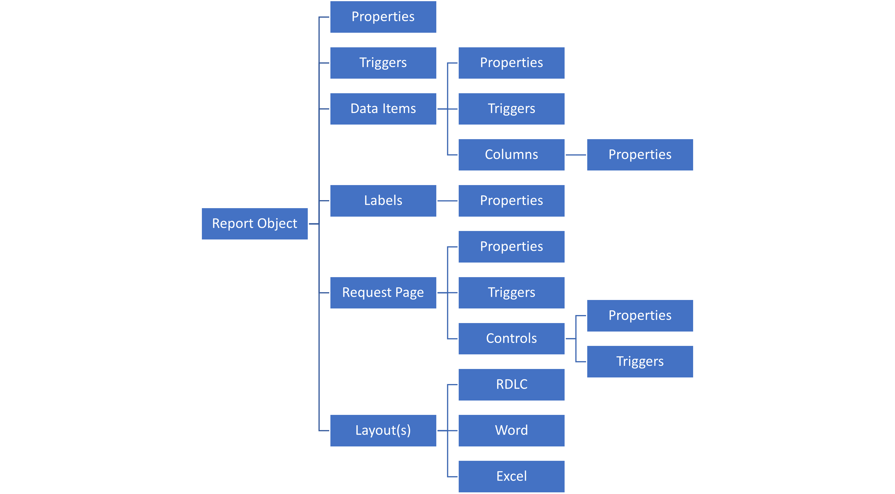

# Introduction to report components in Dynamics 365 Business Central

https://learn.microsoft.com/en-us/training/modules/introduction-report-components/2-learn-overview-report-description

# Use the report design process in Dynamics 365 Business Central

https://learn.microsoft.com/en-us/training/modules/understand-report-design-process/

# Design the data model of a report in Dynamics 365 Business Central

https://learn.microsoft.com/en-us/training/modules/design-data-model-report/

# Add a layout to a report in Dynamics 365 Business Central

https://learn.microsoft.com/en-us/training/modules/add-layout-report/

